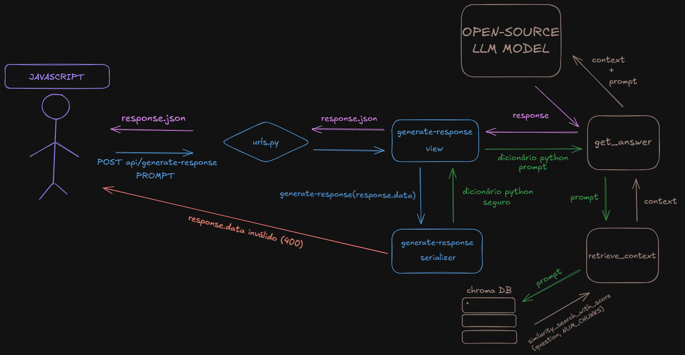
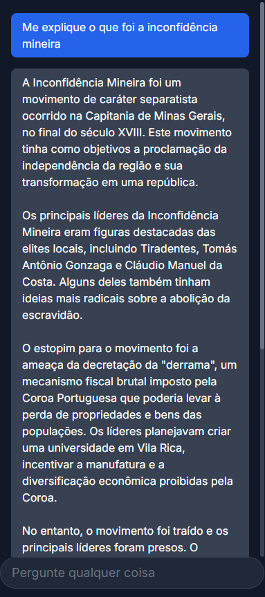

# RAG Django AI Chatbot

*Um assistente de IA local e contextual, capaz de responder perguntas com base em seus próprios documentos.*


## Sumário

Modelos de linguagem genéricos (LLMs) não possuem conhecimento sobre documentos privados ou informações de domínio específico. Este projeto resolve esse problema implementando uma solução completa de **Retrieval-Augmented Generation (RAG)**. A aplicação ingere documentos em formato PDF e Markdown, os processa em um banco de dados vetorial local e utiliza um LLM rodando 100% localmente com Ollama para responder a perguntas dos usuários de forma precisa, factual e baseada estritamente no conteúdo fornecido, através de uma interface de chat interativa.

## Principais Features

* **Interface de Chat Dinâmica:** Frontend interativo construído com HTML e JavaScript para uma experiência de usuário fluida.
* **Ingestão de Múltiplos Formatos:** Suporte nativo para carregar e processar arquivos `.pdf` e `.md`.
* **Pipeline de Dados Robusto:** Utiliza um comando de gerenciamento do Django para popular e atualizar a base de conhecimento de forma segura e eficiente.
* **IA 100% Local:** Roda modelos de embedding e de geração de linguagem via Ollama, garantindo privacidade total e zero custos de API.
* **Busca de Alta Precisão:** Implementa um pipeline RAG avançado com um passo de **Reranking** para aumentar drasticamente a relevância dos contextos recuperados.
* **Backend Escalável:** Construído com Django e Django REST Framework, oferecendo uma API robusta e bem estruturada.

## Tech Stack

* **Backend:** Python, Django, Django REST Framework
* **IA / Machine Learning:** LangChain, Ollama
* **Banco de Dados Vetorial:** ChromaDB
* **Frontend:** HTML, Tailwind CSS, JavaScript
* **Modelos:** `mxbai-embed-large` (Embedding), `llama3` (Geração)

## Diagrama de Fluxo de Dados



## Screenshot




## Quickstart

Siga estes passos para rodar o projeto localmente.

### 1. Pré-requisitos

* Python 3.10 ou superior
* [Ollama](https://ollama.com/download) instalado e em execução.

### 2. Instalação

Clone o repositório e configure o ambiente virtual:

```bash
# Clone o projeto
git clone https://github.com/MatheusChiconi/VectorSearch-RAG-API.git
cd VectorSearch-RAG-API

# Crie e ative o ambiente virtual
python -m venv venv
source venv/bin/activate  # No Linux/macOS
# venv\Scripts\activate # No Windows

# Instale as dependências
pip install -r requirements.txt
```

### 3. Configuração do Ollama

Baixe os modelos necessários que a aplicação utiliza:

```bash
ollama pull mxbai-embed-large
ollama pull llama3
```

### 4. Preparando os Documentos

Adicione seus arquivos `.pdf` e `.md` na pasta `core/files/`.

### 5. Populando o Banco de Dados Vetorial

Execute o comando de gerenciamento para processar seus arquivos. Este passo pode levar alguns minutos.

```bash
python3 manage.py atualizar_vetores
```

### 6. Rodando o Servidor

Inicie o servidor de desenvolvimento do Django.

```bash
python3 manage.py runserver
```

A aplicação estará disponível em: `http://127.0.0.1:8000/`.

## Endpoints Principais

A interação com a IA é feita através do seguinte endpoint:

**POST** `/api/generate-response/`

**Descrição:** Envia um prompt do usuário e recebe uma resposta contextualizada gerada pela IA.

**Corpo da Resposta (JSON)**
```json
{
  "response_text": "A inconfidência mineira é ...",
  "metadata": {
                "model": "llama3",
                "total_tokens": 3500,
              }
```

## Contato

**Nome:** Matheus Fortunato  
**LinkedIn:** https://www.linkedin.com/in/matheus-fortunato-chiconi-91343b284/
